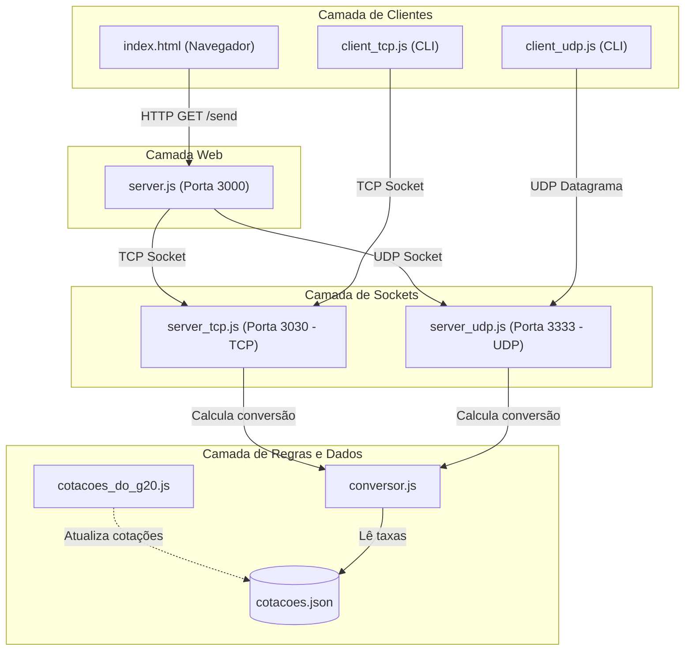

# Sockets TCP & UDP — Conversor de Moedas e Análise de Rede com Wireshark

Projeto pra comparar a comunicação em rede utilizando **Sockets TCP** e **Sockets UDP** em `Node.js`, utilizando a captura de tráfego de pacotes via **Wireshark**.

---

## Arquitetura do Sistema



> [!NOTE]
> Esse diagrama foi feito usando inteligência artificial.

---

## Execução

### 1. Pré-requisitos

- [Node.js](https://nodejs.org/) (v18+) ou [Bun](https://bun.sh/)

### 2. Iniciar os Servidores

Inicia simultaneamente o servidor Web HTTP (3000), o servidor TCP (3030) e o servidor UDP (3333):

```bash
npm start
# ou: node server.js
```

- Interface Web no navegador: [http://localhost:3000](http://localhost:3000)

### 3. Executar os Clientes CLI

Em outro terminal (com os servidores rodando):

```bash
# Cliente TCP (Sintaxe: npm run client:tcp -- <VALOR> <MOEDA>)
npm run client:tcp -- 100 USD

# Cliente UDP (Sintaxe: npm run client:udp -- <VALOR> <MOEDA>)
npm run client:udp -- 100 EUR
```

---

## Análise de Tráfego com Wireshark

Para inspecionar o tráfego de rede gerado pelos sockets:

| Filtro                                   | Finalidade               |
| :--------------------------------------- | :----------------------- |
| `tcp.port == 3030`                       | Tráfego do socket TCP    |
| `udp.port == 3333`                       | Datagramas do socket UDP |
| `tcp.port == 3030 \|\| udp.port == 3333` | Ambos os sockets         |
| `tcp.flags.syn == 1`                     | Abertura da conexão TCP  |

---

## Estrutura do Projeto

```text
sockets_udp_tcp-sd_wireshark/
├── src/
│   ├── client/
│   │   ├── client_tcp.js          # Cliente CLI que se conecta ao socket TCP
│   │   ├── client_udp.js          # Cliente CLI que envia datagramas UDP
│   │   └── index.html             # Interface Web
│   ├── server/
│   │   ├── server_tcp.js          # Servidor socket TCP
│   │   └── server_udp.js          # Servidor socket UDP
│   └── utils/
│       ├── conversor.js           # Lógica de cálculo cambial
│       ├── cotacoes.json          # Cache local de cotações em JSON
│       └── cotacoes_do_g20.js     # Sincronização com API
├── package.json                   # Dependências e scripts
├── server.js                      # Ponto de entrada
└── README.md                      # Documentação
```

---

## 📄 Licença

Este projeto está sob a licença [MIT](./LICENSE).
