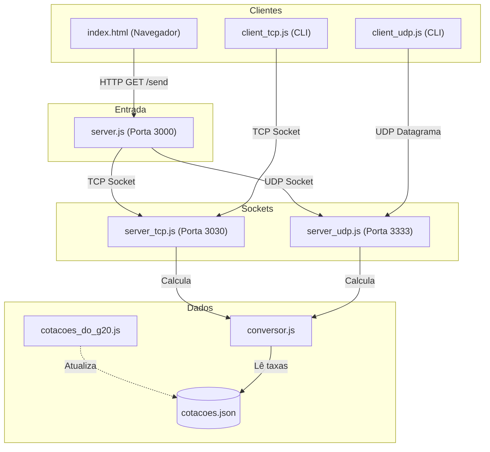

# sockets_udp_tcp-sd_wireshark

Conversor de moedas utilizando sockets TCP e UDP pra análise de rede com Wireshark.

---

## Arquitetura



<span style="color:red">Esse diagram foi feito usando inteligência artificial.</span>

---

## Execução

### 1. Iniciar servidores (TCP, UDP e Web)
```bash
node run server.js
# ou: node start
```
- Interface Web: `http://localhost:3000`
- Servidor TCP: `127.0.0.1:3030`
- Servidor UDP: `127.0.0.1:3333`

### 2. Usar clientes CLI
Em outro terminal, com o servidor ativo:

```bash
bun run src/client/client_tcp.js 10 USD

bun run src/client/client_udp.js 50 EUR
```

---

## Filtros no Wireshark

- **TCP**: `tcp.port == 3030`
- **UDP**: `udp.port == 3333`
